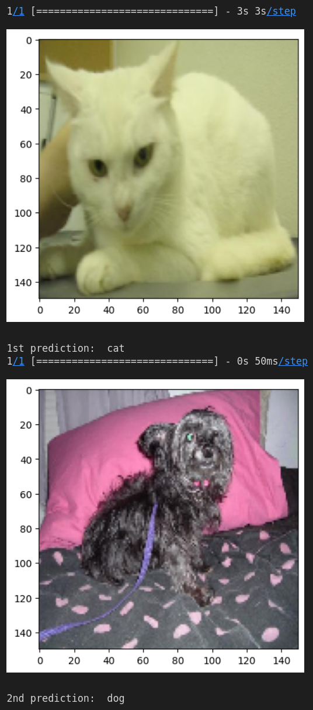
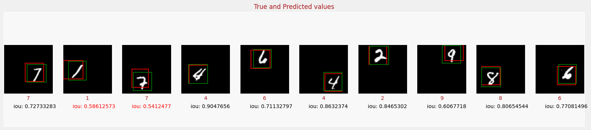

# Tensorflow Computer Vision

 The following repository includes samples projects for computer vision. Including in the repository are: 
 
 <ol>
  <li>Image Classification</li>
  <li>Object Localization</li>
  <li>Object Detection</li>
  <li>Few Shot Object Detection</li>
  <li>Image Segmentation</li>
  <li>Visualization and Interpretability</li>
 </ol>
  
 All code sources are implemented from [Tensorflow](https://www.tensorflow.org/). The content of this Github Repository is based on the the course [Advanced Computer Vision with TensorFlow](https://www.coursera.org/learn/advanced-computer-vision-with-tensorflow) from Coursera and DeepLearning.AI.

## Image Classification

Details about the project is located at [Image Classification](image_classification).

Image classification is a fascinating field of artificial intelligence, and Inception V3 is a neural network architecture that has pushed the boundaries of what's possible in this area. Developed by Google, Inception V3 is designed to accurately classify images with a high degree of accuracy, thanks to its use of deep convolutional neural networks. Its ability to recognize objects, people, and even animals in complex images is truly remarkable. In this project, we trained a Inception V3 model with dogs and cats dataset to classify images into 2 categories, such as dogs and cats.

## Object Localization

Details about the project is located at [Object Localization](image_classification).

Object localization is an advanced technology that enables machines to detect and locate specific objects within an image or video. It plays a critical role in the fields of computer vision, robotics, and artificial intelligence by facilitating the identification of relevant information and supporting decision-making processes. Object localization enables self-driving cars to detect pedestrians and other vehicles, security cameras to detect intruders, and medical devices to diagnose diseases, among other applications. 

In this project, we trained a CNN model with MNIST dataset to detect and locate digits in images. The model is able to not only detect but also localize the digit in the image, giving us precise information about its position and scale. The MNIST dataset is a popular benchmark in the field of computer vision and machine learning. It consists of a collection of 70,000 grayscale images of handwritten digits, with 60,000 images used for training and 10,000 for testing. 

