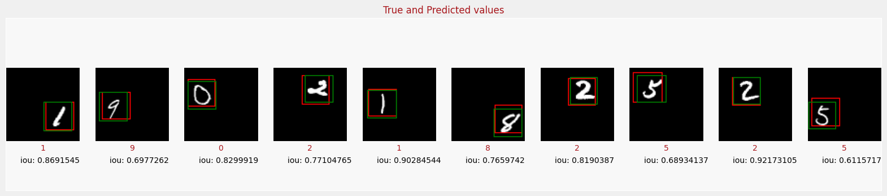

# Object Localization with Convolutional Neural Network

Object localization is a critical task in computer vision, and convolutional neural networks (CNNs) have revolutionized the way we approach it. By using a series of interconnected layers, CNNs are able to extract complex features from an image and accurately identify the presence and location of specific objects. With the use of bounding boxes, the network is able to not only detect but also localize the object in the image, giving us precise information about its position and scale. The potential applications of object localization with CNNs are vast, from self-driving cars to object recognition in medical imaging, and this technology continues to push the boundaries of what's possible in the field of computer vision.



# Install Dependencies

The following dependencies are required to run this tutorial:

- [TensorFlow](https://www.tensorflow.org)

To install dependencies, run the following command:

    pip install -r requirements.txt

## Training the CNN

To train the CNN, we will use the [MNIST](http://yann.lecun.com/exdb/mnist/) dataset, which consists of 70,000 images of handwritten digits. The images are 28x28 pixels, and the labels are the digits themselves. The goal of the network is to take an image as input and output a vector of 10 probabilities, one for each digit. The model also predicts the bounding box for the digit in the image. Run the following command to train the model:

```python
python train.py
```

There are several hyperparameters that can be tuned to improve the performance of the model. The details of the parameter is at the file: `arguments.py`.

## Testing the CNN

To test the CNN, there is an Jupiter notebook file: `test.ipynb`. You can run it to test the model.