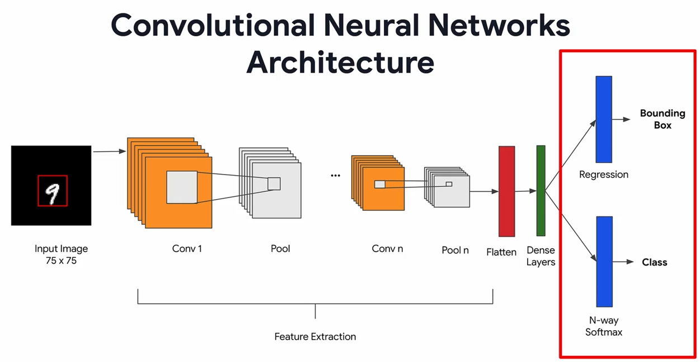

# Object Localization with Convolutional Neural Network

Object localization is a critical task in computer vision, and convolutional neural networks (CNNs) have revolutionized the way we approach it. By using a series of interconnected layers, CNNs are able to extract complex features from an image and accurately identify the presence and location of specific objects. With the use of bounding boxes, the network is able to not only detect but also localize the object in the image, giving us precise information about its position and scale. The potential applications of object localization with CNNs are vast, from self-driving cars to object recognition in medical imaging, and this technology continues to push the boundaries of what's possible in the field of computer vision.

