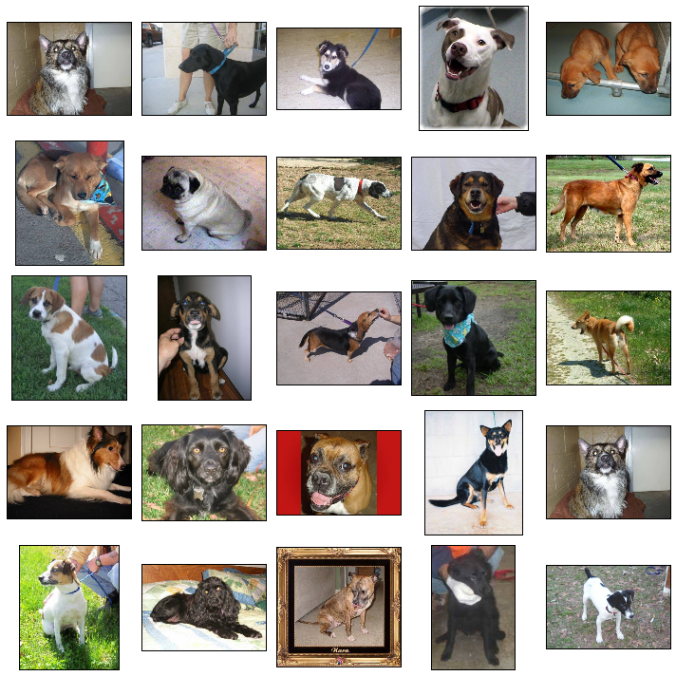

# Image Classification with Inception V3 Pretrained Model

Image classification is a popular task in computer vision and machine learning, which involves categorizing images into predefined classes based on their visual content. The goal of this task is to train a model that can accurately identify the objects present in an image. There are various techniques for solving this task, including traditional machine learning algorithms and deep neural networks. In this tutorial, we will use a deep neural network to classify images into 2 different categories, cat and dog images. We will use the Inception V3 model, which is pretrained on the ImageNet dataset, to classify images. The data we will use is a subset of the [Dogs vs. Cats](https://www.kaggle.com/c/dogs-vs-cats) dataset from Kaggle. The dataset contains 25,000 images of dogs and cats, each of size 150x150 pixels. We will use 20,000 images for training and 5,000 images for testing.

