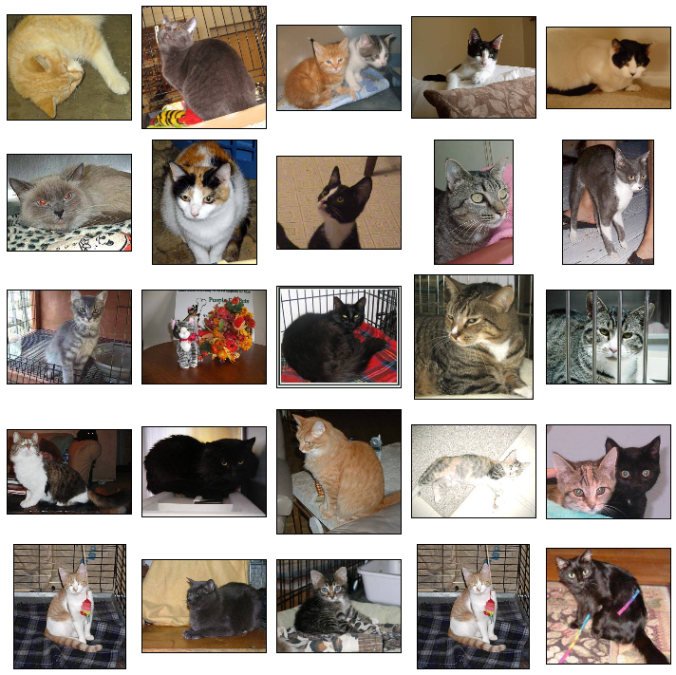

# Image Classification with Inception V3 Pretrained Model

Image classification is a popular task in computer vision and machine learning, which involves categorizing images into predefined classes based on their visual content. The goal of this task is to train a model that can accurately identify the objects present in an image. There are various techniques for solving this task, including traditional machine learning algorithms and deep neural networks. In this tutorial, we will use a deep neural network to classify images into 2 different categories, cat and dog images. We will use the Inception V3 model, which is pretrained on the ImageNet dataset, to classify images. The data we will use is a subset of the [Dogs vs. Cats](https://www.kaggle.com/c/dogs-vs-cats) dataset from Kaggle. The dataset contains 25,000 images of dogs and cats, each of size 150x150 pixels. We will use 20,000 images for training and 5,000 images for testing.

# Pretrained Model

Pretrained models have several advantages over models trained from scratch. Firstly, pretrained models have already learned to extract meaningful features from images, which is a crucial step in the image classification process. Secondly, pretrained models can be fine-tuned with a smaller dataset, which is more feasible and cost-effective compared to collecting and annotating a large dataset. In this tutorial, we will use a pretrained model to classify images into 2 categories, cats and dogs. We will use the Inception V3 model, which is pretrained on the ImageNet dataset, to classify images.

Inception V3 is a deep convolutional neural network (CNN) architecture developed by Google for the ImageNet Large Scale Visual Recognition Challenge (ILSVRC) in 2015. The model was trained on a large dataset of over 1 million images and 1000 classes, making it one of the largest and most comprehensive datasets for image classification. Since its release, Inception V3 has become one of the most widely used pretrained models for image classification, due to its high accuracy and ease of use. The model is capable of classifying images into 1000 different classes, but we will only use it to classify images into 2 classes, cats and dogs.

In this tutorial, we will use the Inception V3 model that is provided by the [TensorFlow](https://www.tensorflow.org). TensorFlow is a Python library for machine learning and deep learning. It provides a variety of tools for building deep neural networks, including the Inception V3 model. The pretrained weights of the Inception V3 model are available to download via [GoogleAPIs](https://storage.googleapis.com/mledu-datasets/inception_v3_weights_tf_dim_ordering_tf_kernels_notop.h5). The model is loaded into the notebook using [the following file](./model/inception_v3.py). 

# Install Dependencies

The following dependencies are required to run this tutorial:

- [TensorFlow](https://www.tensorflow.org)

To install dependencies, run the following command:

    pip install -r requirements.txt

# Prepare Dataset

The dataset we will use is a subset of the [Dogs vs. Cats](https://www.kaggle.com/c/dogs-vs-cats) dataset from Kaggle. The dataset contains 25,000 images of dogs and cats, each of size 150x150 pixels. To download and process the dataset, run the following command:

    python init.py --split_size 0.9

Where split_size is the ratio of training data to the total dataset. The default value is 0.9, which means that 90% of the dataset will be used for training and 10% will be used for testing. The dataset will be downloaded and processed into the following directory structure:

    .
    ├── data
    │   ├── cats-vs-dogs
    │   │   ├── testing
    │   │   │   ├── cats
    │   │   │   └── dogs
    │   │   └── training
    │   │       ├── cats
    │   │       └── dogs
    │   └── PetImages
    │       ├── Cat
    │       └── Dog
    .

# Train Model

To train the model, run the following command:

    python train.py --<hyperparameter> <value>

There are several [hyperparameters](arguments.py) that can be used to train the model. The following table lists the available hyperparameters and their default values:

| Hyperparameter | Default Value | Description |
|----------------|---------------|-------------|
| aug-rescale | 1./255 | Data augmentation rescale |
| aug-rotation | 40 | Data augmentation rotation range |
| aug-width | 0.2 | Data augmentation width shift range |
| aug-height | 0.2 | Data augmentation height shift range |
| aug-shear | 0.2 | Data augmentation shear range |
| aug-zoom | 0.2 | Data augmentation zoom range |
| aug-horiz | True | Data augmentation horizontal flip |
| aug-vert | True | Data augmentation vertical flip |
| aug-fill | 'nearest' | Data augmentation fill mode |
| batch-size | 100 | Batch size |
| epochs | 2 | Number of epochs |
| learning-rate | 0.0001 | Learning rate |
| loss | binary_crossentropy | Loss function |
| metrics | acc | Metrics |

# Test Model

The testing for the model is provided with the Python Notebook [test.ipynb](test.ipynb). To test the model, run the following command:

    jupyter notebook test.ipynb

